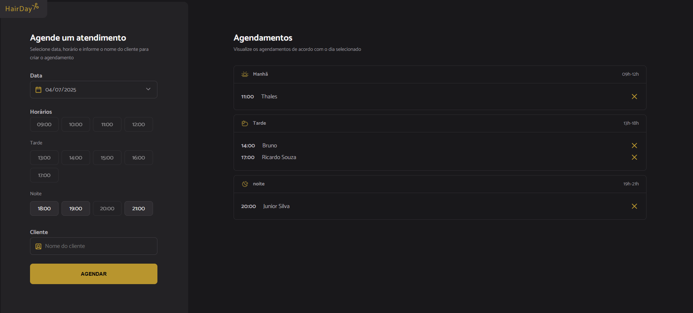
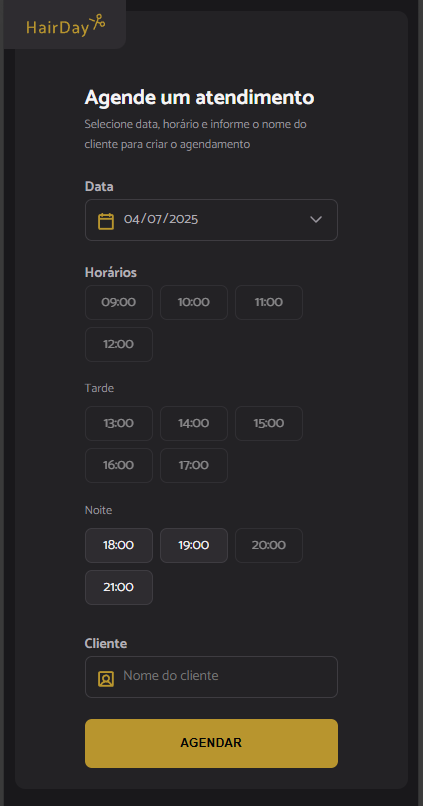
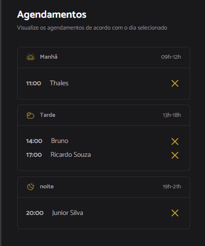

<h1 align="center" style="font-weight: bold;">Haircut Scheduling💻</h1>

<p align="center">
 • <a href="#tech">Technologies</a> • 
 <a href="#installation">Installation</a> • 
 <a href="#started">Getting Started</a> 
</p>

<p align="center">
    <b>
      Application for a barber shop where it is possible to schedule and unschedule haircuts internally by sending data to an API. JSON-server was used to simulate an API, and webpack-server was used to compile HTML, CSS, and JavaScript to run the program. Babel was used to convert the ECMAScript 2015+ code into a version compatible with previous versions of JavaScript in current and older browsers or environments. In addition, the code was modularized and separated to make it easy to maintain.
    </b>
</p>

<h2 id="layout">🎨 Layout Desktop</h2>

<p align="center">
      
</p>

<h2 id="layout">🎨 Layout Mobile</h2>

<p align="center">
      
      
</p>

<h2 id="installation">📱 Installation</h2>

- Clone the project: 
```bash git clone https://github.com/ThalesFortes/hairday.git ```

- Install Json-server.
```bash npm install json-server```

- Install web-pack
```bash npm install --save-dev webpack```

- Install web-pack-dev-server
```bash npm install webpack-dev-server --save-dev```

- Install HTML and CSS plugins
```bash npm i html-webpack-plugin --save-dev ```
```bash npm i style-loader css-loader --save-dev```

- Install Copy WebPack plugin
```bash npm i copy-webpack-plugin --save-dev ```

- Install BabelJS
```bash npm i babel-loader @babel/core @babel/preset-env --save-dev ```

- Install Dayjs
```bash npm install dayjs --save-dev ```

<h2 id="tech">💻 Technologies</h2>

- HTML5
- CSS3
- JAVASCRIPT
- JSON-SERVER

<h2 id="started">🚀 Getting started</h2>

- Build the project
```bash npm run build ```

- Start API.
```bash npm run server ```

- Start webpack-server.
```bash npm run dev ```
